# ProcTIME Dataflow

This document summarizes how scripts under `scripts/` consume files from `data/` and produce reusable intermediate data in `data/` or final results in `output/`.

The main reusable pipeline is:

1. Build cohort-specific expression and clinical datasets.
2. Run deconvolution to derive TIME features.
3. Use TCGA as the discovery cohort for QC, clustering, and classifier training.
4. Apply the TCGA-trained classifier to validation cohorts.
5. Run downstream clinical, survival, pathway, and visualization analyses.

## Main Dataflow

```mermaid
flowchart TD
    subgraph RawInputs[Raw and external inputs]
        GDC[GDC and Firehose TCGA PRAD]
        OUHRaw[data/OUH/*]
        DKFZRaw[data/prostate_dkfz_2018/*]
        LongRaw[data/GSE54460/*]
        RiskMSKCC[data/risk_score_from_DeepSurv_mskcc.csv]
        MSKCCCluster[data/clustering_mskcc.RData]
        Quantiseq[data/tcga_time_deconv_quantiseq.RData]
    end

    subgraph TCGA[TCGA discovery backbone]
        S1[data_download_preprocess_tcga.R]
        D1[data/prad_data_tcga.RData]
        S2[deconv_time_tcga.R]
        D2[data/tcga_time_deconv.RData]
        C2[data/time_epic_bcr_tcga.csv]
        S3[PCA_time_tcga.R]
        D3[data/tcga_time_deconv_rm_outlier.RData]
        S4[clustering_TCGA.R]
        D4[data/clustering_tcga_original.RData]
        D5[data/clustering_tcga_removing_badguys.RData]
        D6[data/tcga_scaling_params.RData]
        O1[output/Consensus_clustering_epic_pam_pearson_average_tcga/*]
        O2[output/surv_curv_3_groups.pdf]
        S5[train_classifier_on_TCGA.R]
        D7[data/model_3classes_tcga.RData]
        S6[ESTIMATE_TCGA.R]
        D8[data/ESTIMATE_TCGA.RData]
    end

    subgraph OUH[OUH validation branch]
        Ouh1[data_preprocess_ouh.R]
        Ouh2[data/prad_data_ouh.RData]
        Ouh3[deconv_time_ouh.R]
        Ouh4[data/ouh_time_deconv.RData]
        Ouh5[data/time_epic_bcr_ouh.csv]
        Ouh6[classification_ouh.R]
        Ouh7[data/prediction_3_ouh.RData]
        Ouh8[output/pred3_of_sample_vs_patient.pdf]
        Ouh9[output/prediction_3_ouh.csv]
    end

    subgraph DKFZ[DKFZ Hamburg validation branch]
        Dk1[data_preprocess_dkfz.R]
        Dk2[data/prad_data_dkfz.RData]
        Dk3[deconv_time_dkfz.R]
        Dk4[data/dkfz_time_deconv.RData]
        Dk5[data/time_epic_bcr_dkfz.csv]
        Dk6[classification_3_dkfz.R]
        Dk7[data/prediction_3_dkfz.RData]
        Dk8[output/classification_3classes_dkfz.pdf]
    end

    subgraph Long[Long Atlanta validation branch]
        L1[data_preprocess_long_GSE54460.R]
        L2[data/prad_data_long.RData]
        L3[deconv_time_long.R]
        L4[data/long_time_deconv.RData]
        L5[data/time_epic_bcr_long.csv]
        L6[classification_3_long.R]
        L7[data/prediction_3_long.RData]
        L8[output/classification_3classes_long.pdf]
    end

    subgraph Downstream[Downstream analyses and figures]
        A1[dea_gsea.R]
        A2[output/dea_gsea/*]
        A3[stromal_validation.R]
        A4[output/stromal_validation/*]
        A5[association_clinicopathological.R]
        A6[output/association_subtypes_*.pdf]
        A7[surv_grade_cluster.R]
        A8[output/CI_tcga.pdf and survival summaries]
        A9[heatmap_classes_*.R]
        A10[output/heatmap/*]
        A11[draw_cell_composition.R]
        A12[output/example_cell_composition.pdf]
        A13[compare_epic_quantiseq.R]
        A14[output/Venn_comparison_EPIC_quanTIseq/*]
        A15[output/Robustness_Check_EPIC_quanTIseq/*]
        A16[cor_deconv_ouh.R]
        A17[output/corr_3comparisons_*.pdf]
        A18[epithelial_tumor_purity.R]
        A19[output/association_epithelial_tumor_purity_oslo.pdf]
        A20[risk_score_of_clusters_mskcc.R]
        A21[output/risk_score_of_clusters_mskcc.pdf]
        A22[surv_mskcc_deepsurv_risk_score.R]
        A23[output/km_mskcc_on_risk_score.pdf]
    end

    GDC --> S1 --> D1
    D1 --> S2 --> D2
    S2 --> C2
    D2 --> S3 --> D3
    D3 --> S4
    S4 --> D4
    S4 --> D5
    S4 --> D6
    S4 --> O1
    S4 --> O2
    D5 --> S5 --> D7
    D1 --> S6 --> D8

    OUHRaw --> Ouh1 --> Ouh2
    Ouh2 --> Ouh3 --> Ouh4
    Ouh3 --> Ouh5
    Ouh4 --> Ouh6
    D5 --> Ouh6
    D6 --> Ouh6
    D7 --> Ouh6
    Ouh6 --> Ouh7
    Ouh6 --> Ouh8
    Ouh6 --> Ouh9

    DKFZRaw --> Dk1 --> Dk2
    Dk2 --> Dk3 --> Dk4
    Dk3 --> Dk5
    Dk4 --> Dk6
    D5 --> Dk6
    D6 --> Dk6
    D7 --> Dk6
    Dk6 --> Dk7
    Dk6 --> Dk8

    LongRaw --> L1 --> L2
    L2 --> L3 --> L4
    L3 --> L5
    L4 --> L6
    D5 --> L6
    D6 --> L6
    D7 --> L6
    L6 --> L7
    L6 --> L8

    D5 --> A1
    D1 --> A1
    A1 --> A2

    D5 --> A3
    D1 --> A3
    D8 --> A3
    A3 --> A4

    D5 --> A5
    Ouh7 --> A5
    Ouh4 --> A5
    L7 --> A5
    L4 --> A5
    Dk7 --> A5
    Dk4 --> A5
    A5 --> A6

    D5 --> A7
    L7 --> A7
    L4 --> A7
    Dk7 --> A7
    Dk4 --> A7
    A7 --> A8

    D5 --> A9
    Ouh7 --> A9
    Ouh4 --> A9
    L7 --> A9
    Dk7 --> A9
    A9 --> A10

    D2 --> A11 --> A12

    D1 --> A13
    D2 --> A13
    Quantiseq --> A13
    A13 --> A14
    A13 --> A15

    Ouh4 --> A16 --> A17
    Ouh4 --> A18 --> A19

    MSKCCCluster --> A20
    RiskMSKCC --> A20
    A20 --> A21
    RiskMSKCC --> A22
    A22 --> A23
```

## Backbone Summary

### 1. TCGA discovery cohort

`data_download_preprocess_tcga.R`

- Input: TCGA clinical data from GDC and TCGA PRAD RNA expression from Firehose.
- Output to `data/`: `prad_clinical_tcga.txt`, `prad_clinical_bcr_tcga.txt`, `prad_gene_tcga.txt`, `prad_data_tcga.RData`.

`deconv_time_tcga.R`

- Input: `prad_data_tcga.RData`.
- Output to `data/`: `time_epic_bcr_tcga.csv`, `tcga_time_deconv.RData`.

`PCA_time_tcga.R`

- Input: `tcga_time_deconv.RData`.
- Role: identifies outlier patients and removes them for downstream modeling.
- Output to `data/`: `tcga_time_deconv_rm_outlier.RData`.

`clustering_TCGA.R`

- Input: `tcga_time_deconv_rm_outlier.RData`.
- Role: scales deconvolution features, performs consensus clustering, derives TCGA subtype labels.
- Output to `data/`: `tcga_scaling_params.RData`, `clustering_tcga_original.RData`, `clustering_tcga_removing_badguys.RData`.
- Output to `output/`: consensus clustering PDFs and survival plots.

`train_classifier_on_TCGA.R`

- Input: `clustering_tcga_removing_badguys.RData`.
- Role: trains the LDA classifier used for validation cohorts.
- Output to `data/`: `model_3classes_tcga.RData`.

`ESTIMATE_TCGA.R`

- Input: `prad_data_tcga.RData`.
- Output to `data/`: `ESTIMATE_TCGA.RData`.

### 2. External validation cohorts

OUH branch:

`data_preprocess_ouh.R`

- Input: `data/OUH/tpm_batch_corrected_18349_genes_reshaped.tsv`, `data/OUH/til_xiaokang_data.xlsx`, `data/OUH/til_xiaokang_bcr.xlsx`, `data/OUH/til_xiaokang_age.xlsx`.
- Output to `data/`: `prad_data_ouh.RData`.

`deconv_time_ouh.R`

- Input: `prad_data_ouh.RData`.
- Output to `data/`: `time_epic_bcr_ouh.csv`, `ouh_time_deconv.RData`.

`classification_ouh.R`

- Input: `ouh_time_deconv.RData`, `clustering_tcga_removing_badguys.RData`, `tcga_scaling_params.RData`, `model_3classes_tcga.RData`.
- Role: batch-corrects OUH against TCGA, scales using TCGA parameters, predicts TCGA-derived classes, and exports a readable sample-level summary with OUH patient metadata.
- Output to `data/`: `prediction_3_ouh.RData`.
- Output to `output/`: `pred3_of_sample_vs_patient.pdf`, `prediction_3_ouh.csv`.

DKFZ branch:

`data_preprocess_dkfz.R`

- Input: `data/prostate_dkfz_2018/data_mrna_seq_rpkm.txt`, `data/prostate_dkfz_2018/data_clinical_patient.txt`, `data/prostate_dkfz_2018/prostate_dkfz_2018_clinical_data.tsv`.
- Output to `data/`: `prad_data_dkfz.RData`.

`deconv_time_dkfz.R`

- Input: `prad_data_dkfz.RData`.
- Output to `data/`: `time_epic_bcr_dkfz.csv`, `dkfz_time_deconv.RData`.

`classification_3_dkfz.R`

- Input: `dkfz_time_deconv.RData`, `clustering_tcga_removing_badguys.RData`, `tcga_scaling_params.RData`, `model_3classes_tcga.RData`.
- Output to `data/`: `prediction_3_dkfz.RData`.
- Output to `output/`: `classification_3classes_dkfz.pdf`.

Long branch:

`data_preprocess_long_GSE54460.R`

- Input: `data/GSE54460/GSE54460_FPKM.xlsx`, `data/GSE54460/GSE54460_clinical_info.xlsx`.
- Output to `data/`: `prad_data_long.RData`.

`deconv_time_long.R`

- Input: `prad_data_long.RData`.
- Output to `data/`: `time_epic_bcr_long.csv`, `long_time_deconv.RData`.

`classification_3_long.R`

- Input: `long_time_deconv.RData`, `clustering_tcga_removing_badguys.RData`, `tcga_scaling_params.RData`, `model_3classes_tcga.RData`.
- Output to `data/`: `prediction_3_long.RData`.
- Output to `output/`: `classification_3classes_long.pdf`.

## Downstream Analyses

These scripts mostly consume intermediate `.RData` files and produce results under `output/`.

| Script | Main inputs | Main outputs | Role |
| --- | --- | --- | --- |
| `dea_gsea.R` | `clustering_tcga_removing_badguys.RData`, `prad_data_tcga.RData` | `output/dea_gsea/DEA_*.csv`, `GSEA_*.RData`, `GSEA_*.csv`, `*.pdf` | Differential expression and pathway analysis across TCGA subtypes. |
| `stromal_validation.R` | `clustering_tcga_removing_badguys.RData`, `prad_data_tcga.RData`, `ESTIMATE_TCGA.RData` | `output/stromal_validation/*` | Validates stromal and tumor-purity behavior of the TCGA subtypes. |
| `association_clinicopathological.R` | TCGA clusters plus OUH, Long, DKFZ predictions and deconvolution objects | `output/association_subtypes_*.pdf` | Tests subtype associations with Gleason score and pT stage across cohorts. |
| `surv_grade_cluster.R` | `clustering_tcga_removing_badguys.RData`, `prediction_3_long.RData`, `long_time_deconv.RData`, `prediction_3_dkfz.RData`, `dkfz_time_deconv.RData` | `output/CI_tcga.pdf` and survival summaries | Cox models and concordance improvement from adding TIME subtype information. |
| `heatmap_classes_ouh.R` | `prediction_3_ouh.RData`, `ouh_time_deconv.RData` | `output/heatmap/heatmap_ouh_3_subtypes.pdf` | Heatmap of predicted OUH subtypes. |
| `heatmap_classes_long.R` | `prediction_3_long.RData` | `output/heatmap/heatmap_long_3_subtypes.pdf` | Heatmap for Long cohort predicted subtypes. |
| `heatmap_classes_dkfz.R` | `prediction_3_dkfz.RData` | `output/heatmap/heatmap_dkfz_3_subtypes.pdf` | Heatmap for DKFZ cohort predicted subtypes. |
| `draw_cell_composition.R` | `tcga_time_deconv.RData` | `output/example_cell_composition.pdf` | Example TIME composition figure. |
| `cor_deconv_ouh.R` | `ouh_time_deconv.RData` | `output/corr_3comparisons_similarity.pdf`, `output/corr_3comparisons_similarity_pval.pdf` | Correlation analysis across OUH samples and foci. |
| `epithelial_tumor_purity.R` | `ouh_time_deconv.RData` | `output/association_epithelial_tumor_purity_oslo.pdf` | OUH tumor-purity related plot. |
| `compare_epic_quantiseq.R` | `prad_data_tcga.RData`, `tcga_time_deconv.RData`, `tcga_time_deconv_quantiseq.RData` | `output/comparison_epic/*`, `output/comparison_quantiseq/*`, `output/Venn_comparison_EPIC_quanTIseq/*`, `output/Robustness_Check_EPIC_quanTIseq/*` | Compares EPIC and quanTIseq clustering robustness. |
| `risk_score_of_clusters_mskcc.R` | `clustering_mskcc.RData`, `risk_score_from_DeepSurv_mskcc.csv` | `output/risk_score_of_clusters_mskcc.pdf` | Relates MSKCC cluster labels to DeepSurv risk score. |
| `surv_mskcc_deepsurv_risk_score.R` | `prad_data_mskcc.RData`, `risk_score_from_DeepSurv_mskcc.csv` | `output/km_mskcc_on_risk_score.pdf` | Survival analysis using DeepSurv risk score in MSKCC. |

## Utility and Mostly Standalone Scripts

These are present in `scripts/` but are not central handoff points in the reusable data pipeline.

| Script | Notes |
| --- | --- |
| `color_palette.R` | Shared plotting colors sourced by several analysis scripts. |
| `check_rownames.R` | Small consistency check using `prad_data_tcga.RData`. |
| `CIBERSORT.R` | Generic deconvolution helper script, not wired into the main EPIC-based pipeline. |
| `heatmap_deconv_tcga.R` | Produces heatmaps, but also references `clustering_dkfz.RData` and `clustering_long.RData`, which are not generated by the main visible scripts. |

## Artifact-Centric View

If you want the shortest reusable chain, it is:

- `prad_data_tcga.RData` -> `tcga_time_deconv.RData` -> `tcga_time_deconv_rm_outlier.RData` -> `clustering_tcga_removing_badguys.RData` -> `model_3classes_tcga.RData`
- `prad_data_ouh.RData` -> `ouh_time_deconv.RData` -> `prediction_3_ouh.RData` with readable export `output/prediction_3_ouh.csv`
- `prad_data_dkfz.RData` -> `dkfz_time_deconv.RData` -> `prediction_3_dkfz.RData`
- `prad_data_long.RData` -> `long_time_deconv.RData` -> `prediction_3_long.RData`

Those prediction and clustering artifacts then feed most of the figures and downstream statistical analyses under `output/`.

## Ambiguities and Likely Precomputed Inputs

- `compare_epic_quantiseq.R` expects `data/tcga_time_deconv_quantiseq.RData`, but no visible script in `scripts/` creates that file.
- `risk_score_of_clusters_mskcc.R` expects `data/clustering_mskcc.RData`, but the script producing it is not visible in the current `scripts/` set.
- `heatmap_deconv_tcga.R` references `clustering_dkfz.RData` and `clustering_long.RData`, which do not appear to be generated by the visible preprocessing and classification scripts.
- Some scripts still contain commented two-class variants, but the active pipeline is clearly the three-class `TCE`, `EPCE`, `TASCE` workflow.
